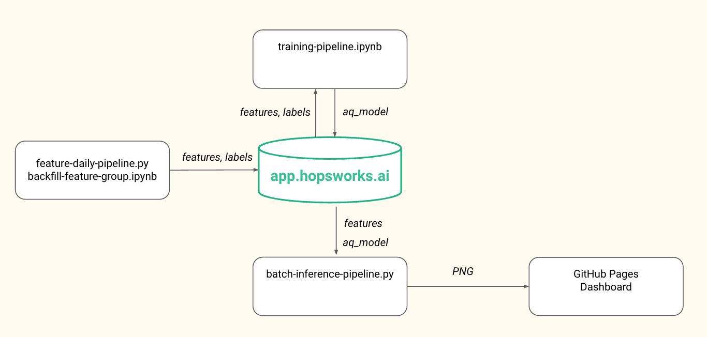

 
# Serverless Air Quality Prediction with Hopsworks 

This project implements a serverless pipeline for daily air quality prediction, leveraging Hopsworks for feature management and model storage, GitHub Actions for automation, and GitHub Pages for visualization. The primary feature being predicted is **pm25**, using an XGBoost regression model.

---

## Project Structure

The project is divided into the following components:

### 1. **Feature Engineering and Data Management**
- **`1_air_quality_feature_backfill.ipynb`**: Backfills historical air quality data into Hopsworks.
- **`2_air_quality_feature_pipeline.ipynb`**: Runs daily to ingest real-time weather data and process features.

### 2. **Model Training**
- **`3_air_quality_training_pipeline.ipynb`**: Trains an XGBoost regression model locally and stores it in Hopsworks. Feature importance is extracted during this process.

### 3. **Batch Inference**
- **`4_air_quality_batch_inference.ipynb`**: Runs daily to fetch the latest features and makes the daily prediction before comparing it to the actual PM2.5 value of the day.

---

## Automation with GitHub Actions

The pipelines `2_air_quality_feature_pipeline.ipynb` and `4_air_quality_batch_inference.ipynb` are executed daily through a GitHub Actions workflow defined in `.github/workflows/air-quality-daily.yml`.

---

## Visualization Dashboard

A user interface hosted on GitHub Pages displays:
1. A weekly forecast plot.
2. A hindcast plot showing predictions vs. actual values for the last days.
3. A graph of feature importance from the trained model.

The assets for these visualizations are stored in the respective directories:
- **Forecast Plot**: `docs/air-quality/assets/img/pm25_forecast.png`
- **Hindcast Plot**: `docs/air-quality/assets/img/pm25_hindcast_3days.png`
- **Feature Importance**: `air_quality_model/images/feature_importance.png`

---

## View Results

Visit the [Github Pages](https://celdot.github.io/serverless_ml_lab1) site to view the predictions and feature importance graphs.

## Data

The data is taken from [aqicn.org](https://aqicn.org/station/france/paris/paris-18eme/) and [Open-Meteo](https://open-meteo.com/)

## Bonus part

Added a new feature based on a rolling window of 3 days for 'pm25' called "pm25_3days" to make the predictions
